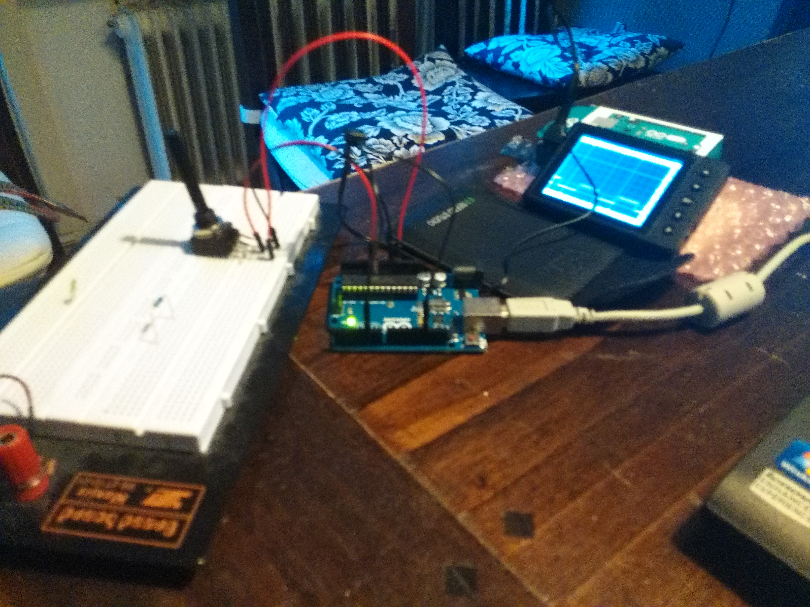

# pws
profielwerkstuk

##Voortgang:

##todo
1. transistor toevoegen
de pwm zit op pin 5, kan niet genoeg stroom leveren voor luidspreker,
dus gebruiken we een transistor.
2. timer interrupt
3. frequentie van pwm omhoog

opties:

1. kant en klaar d versterker https://www.kiwi-electronics.nl/componenten-onderdelen/geluid-muziek-onderdelen/stereo-20w-class-d-audio-versterker-MAX9744
	zelf volume knop maken met I2C 
2. zelf klasse d versterker bouwen https://www.youtube.com/watch?v=CrAB9rIcakE
3. gadgettronix klasse A/B 30 watt http://www.gadgetronicx.com/diy-stereo-amplifier-circuit-diagram/
- long tailed pair
- miller cap, voltage amplification stage
- push/pull stage, darlington

Voor/nadelen 

Klasse D: geen koeling nodig, want uitgangstrap alleen aan en uit dus geen weerstand geen hitte. Componenten kunnen dicht bij elkaar. Kan kleiner. Batterij voeding voldoende. Wel programeren. 
Arduino programeren. In Arduino IDE. Aansluiten op transistor, want chip kan geen stroom leveren. 

Klasse A/B: Groot, koeler nodig., want hitte. Grote voeding. Niet programeren. 
