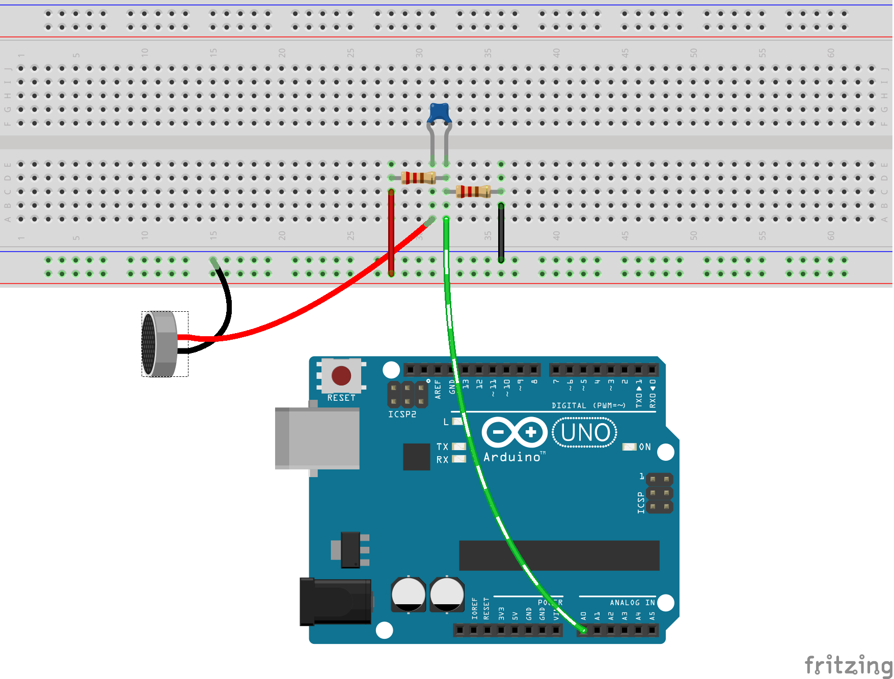

# pws
profielwerkstuk

##PWM

Een klasse D versterker maakt gebruik van puls breedte modulatie (pwm). Het uitgangssignaal is een blokgolf, waarbij de breedte van het blok evenredig varieert met het geluidssignaal. In dit project wordt de blokgolf door een arduino gemaakt. De arduino is een bordje waarop een microcontrollerchip (atmega 328p) werkt. Het voordeel is dat deze zowel een analoge ingang als digitale uitgang heeft (pwm). Het te versterken signaal kunnen we inlezen met de analoge ingang en omzetten naar een pwm signaal. Dit alles door te programmeren in C. Echter stuiten wij op het volgende probleem. De arduino programmeeromgeving (ide) maakt gebruik van een dialect van de programmeertaal c en geeft geen toegang tot alle mogelijkheden van de atmegachip. Ook niet degene die wij nodig hebben. 
Te weten: De standaard pwm frequentie is veel te laag, deze ligt in het hoorbare gebied (freq. lager dan 20 kHz). Bij pwm willen we een gemiddelde hoorbaar maken en niet de puls zelf. Hiervoor moet de frequentie dus ver boven het hoorbare gebied liggen. Door de puls zelf weg te filteren houden wij het gemiddelde over wat het gewenste signaal is. 

###Werking pwm op atmega 328p

Wij maken gebruik van de [datasheet](http://www.atmel.com/images/atmel-8271-8-bit-avr-microcontroller-atmega48a-48pa-88a-88pa-168a-168pa-328-328p_datasheet_complete.pdf) voor de atmega328p. Dit is gebruikelijk in de elektronica om gebruik te maken van de datasheets van onderdelen. Hier staat de werking van de atmega328p beschreven. 
De pwm maakt gebruik van een telregister (TCR). Deze telt van 0 tot TOP en begint daarna weer bij nul (ad infinitum). De uitgang kan gekoppeld worden aan de output compare register (OCR), deze bevat een zeker getal. Als TCR tussen 0 en dit getal is, dan is de uitgangspin hoog en anders laag. Dus de verhouding OCR TOP bepaalt de breedte van de puls. 
De atmega328p heeft 3 pwm registers, twee 8-bits en één 16-bits. 8-bits is een te lage resolutie voor goed geluid. 16-bits is CD kwaliteit, maar dan wordt de frequentie te laag. 
Het tellen gaat met de snelheid van de central prossesing unit (CPU) klok. Deze is 16 MHz. Dus 1 periode duurt: 65535 * (1/16000000)= 0.0040959375 seconden = 243 Hz. Dit is een extreem lage frequentie. Dit zit vol in het hoorbare gebied. Beetje jammer. Dus is het voordelig als we het register in de 10-bits modus zetten. Dus 1024 * (1/1600000) = 0.000064 seconden = 15625 Hz. Dit vinden wij acceptabel. Nu moeten we de admega 328p dus instellen op 10-bits FAST PWM. Hoe dit moet staat beschreven in de datasheet paragraaf 16.11 ofzo. Hier staat welke bits hoe ingesteld moeten worden. Om de TCR in non-inverting pwm mode te zetten moet de 8e bit van het TTCR1A register aan zijn. Om de 10-bits FAST PWM aan te zetten moeten bit 1 en 2 ook aan. 
```c
	TCCR1A = 0b10000011;
```


##Voortgang:


##todo
1. transistor toevoegen
de pwm zit op pin 5, kan niet genoeg stroom leveren voor luidspreker,
dus gebruiken we een transistor.
2. timer interrupt
3. frequentie van pwm omhoog
4. schema afmaken 

##schema



opties:

1. kant en klaar d versterker https://www.kiwi-electronics.nl/componenten-onderdelen/geluid-muziek-onderdelen/stereo-20w-class-d-audio-versterker-MAX9744
	zelf volume knop maken met I2C 
2. zelf klasse d versterker bouwen https://www.youtube.com/watch?v=CrAB9rIcakE
3. gadgettronix klasse A/B 30 watt http://www.gadgetronicx.com/diy-stereo-amplifier-circuit-diagram/
- long tailed pair
- miller cap, voltage amplification stage
- push/pull stage, darlington

Voor/nadelen 

Klasse D: geen koeling nodig, want uitgangstrap alleen aan en uit dus geen weerstand geen hitte. Componenten kunnen dicht bij elkaar. Kan kleiner. Batterij voeding voldoende. Wel programeren. 
Arduino programeren. In Arduino IDE. Aansluiten op transistor, want chip kan geen stroom leveren. 

Klasse A/B: Groot, koeler nodig., want hitte. Grote voeding. Niet programeren. 
